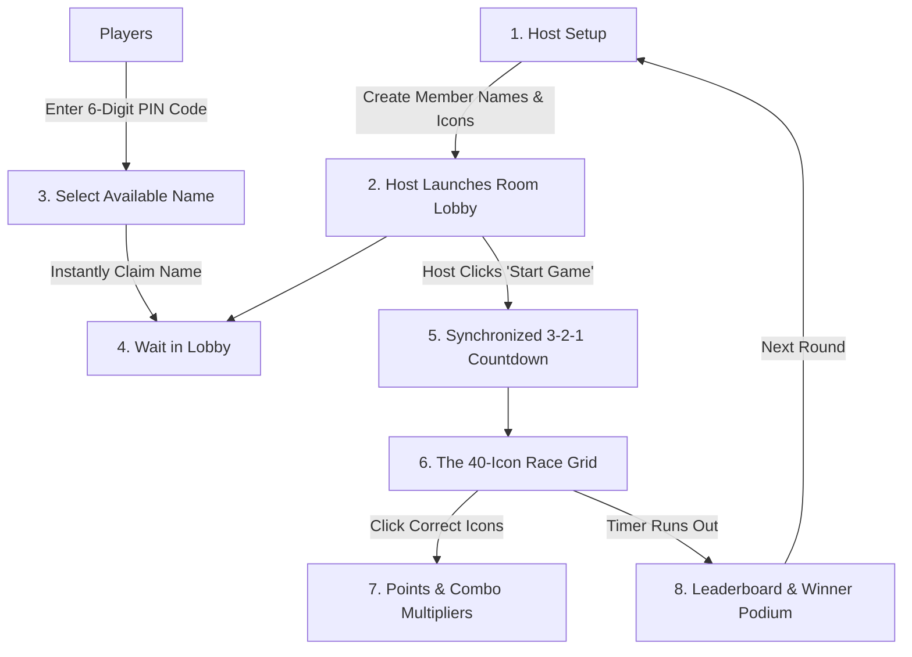

# 🎯 Grape Dawn Icon Arena - Simple Game Logic Guide

Welcome! This guide explains how **Grape Dawn Icon Arena** works in simple, non-technical everyday language.

---

## 💡 What is the Game?

**Grape Dawn Icon Arena** is a fast-paced, live multiplayer race where players spot and click icons related to their assigned member or business category.

Imagine a room full of 40 mixed icons (some correct, some distractors). Players race against the clock to click **ONLY** the icons that match their assigned member name!

---

## 🎮 How the Game Works (Step-by-Step)

---

### Step 1: Admin / Host Setup
1. The **Admin / Host** opens the Admin setup page (`/admin`).
2. The Host creates or loads a list of **Target Member Names** (e.g., 34 BNI Nexora members like *Amit Chang - UPVC Doors*, *Manthan Pawar - Branding*, *Dr. Seema Rathod - Dentist*).
3. For each member, the Host sets:
   - **10 Relevant Icons & Emojis** (correct items matching that member's business).
   - **30 Distractor Icons & Emojis** (wrong items to trick the player).
4. The Host sets the **Game Timer** (e.g., 30 seconds) and clicks **"Launch Room Lobby"**.
5. The system generates a **6-Digit Room PIN Code** (e.g., `GAME84`).

---

### Step 2: Player Entry & Room Lobby
1. Players open the game homepage on their phone, tablet, or laptop.
2. Players enter the **6-Digit Room PIN Code**.
3. Players see the list of Member Names.
4. **Unique Name Claiming**:
   - Each member name can only be picked by **ONE player**.
   - As soon as a player clicks their name, they **instantly enter the Waiting Room Lobby**, and that name turns **"Claimed"** for everyone else.
5. **Admin Kick Control**:
   - If a player accidentally picks the wrong name, the Host can click **"Kick / Reset Name"** in the lobby to send them back to pick their correct name.

---

### Step 3: The Live Game Race
1. When all players are ready, the Host clicks **"Start Game"**.
2. Everyone sees a synchronized **3... 2... 1... GO!** countdown on their screen.
3. Every player enters their own randomized grid of **40 Icons**:
   - 10 Correct / Relevant Icons
   - 30 Wrong / Distractor Icons
4. Players click as fast as they can:
   - **Correct Click (Green Pulse)**: +100 Points, success chime sound effect, icon checks off.
   - **Wrong Click (Red Shake)**: Penalty (e.g. -25 Points), error buzz sound effect.
   - **Combo Streaks**: Consecutive correct clicks trigger a **Combo Multiplier** (2x, 3x, 5x Points!) with bonus pitch-shifting sounds. A wrong click resets the combo.

---

### Step 4: Leaderboard & Winner Announcement
1. The game round ends when the timer reaches 0 or all relevant icons are found.
2. The system calculates every player's score based on:
   - **Accuracy %**: (Correct Clicks ÷ Total Clicks) × 100
   - **Speed**: Time taken to find the relevant icons
   - **Total Points**: (Base Points - Penalty Points) + Combo Bonuses
3. **Who Wins?**
   - 🥇 **1st Place (Gold Podium & Crown)**: Highest Accuracy % + Fastest Time
   - 🥈 **2nd Place (Silver Podium)**
   - 🥉 **3rd Place (Bronze Podium)**
4. Celebration confetti explodes, and the Host can start a new round!

---

## 📊 Simple Scoring Summary

| Action | Result |
| :--- | :--- |
| **Correct Icon Clicked** | **+100 Points** + Green Ripple |
| **Consecutive Correct Click (Combo)** | **2x / 3x / 5x Bonus Multiplier** 🔥 |
| **Wrong Icon Clicked** | **-25 Points** + Red Shake |
| **Accuracy %** | **100%** if no wrong clicks made |
| **Winner Determination** | **Highest Accuracy %** first, then **Points** & **Speed** |
